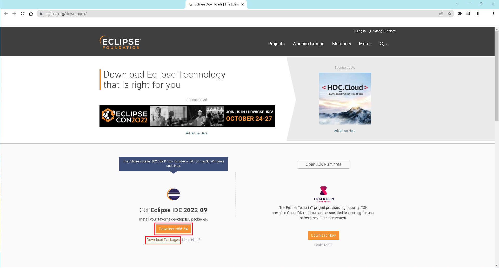
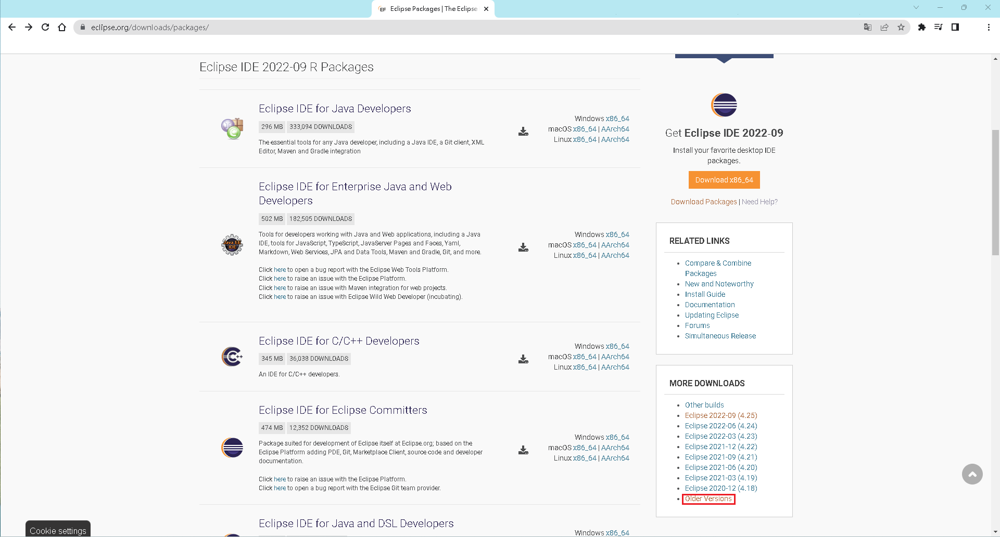
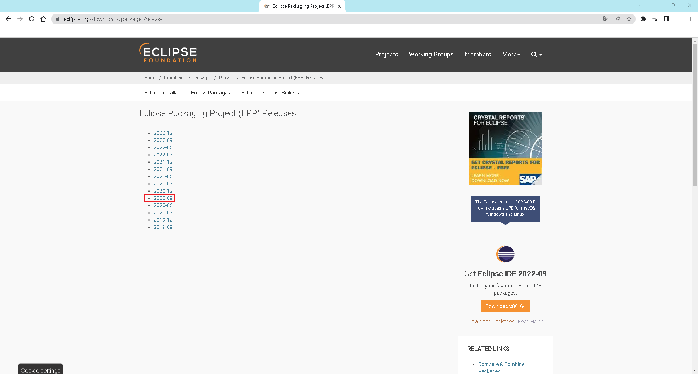
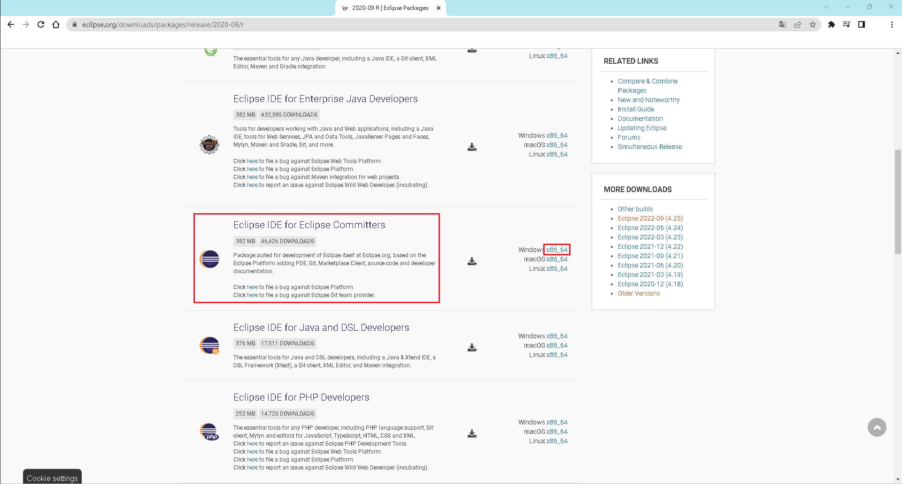
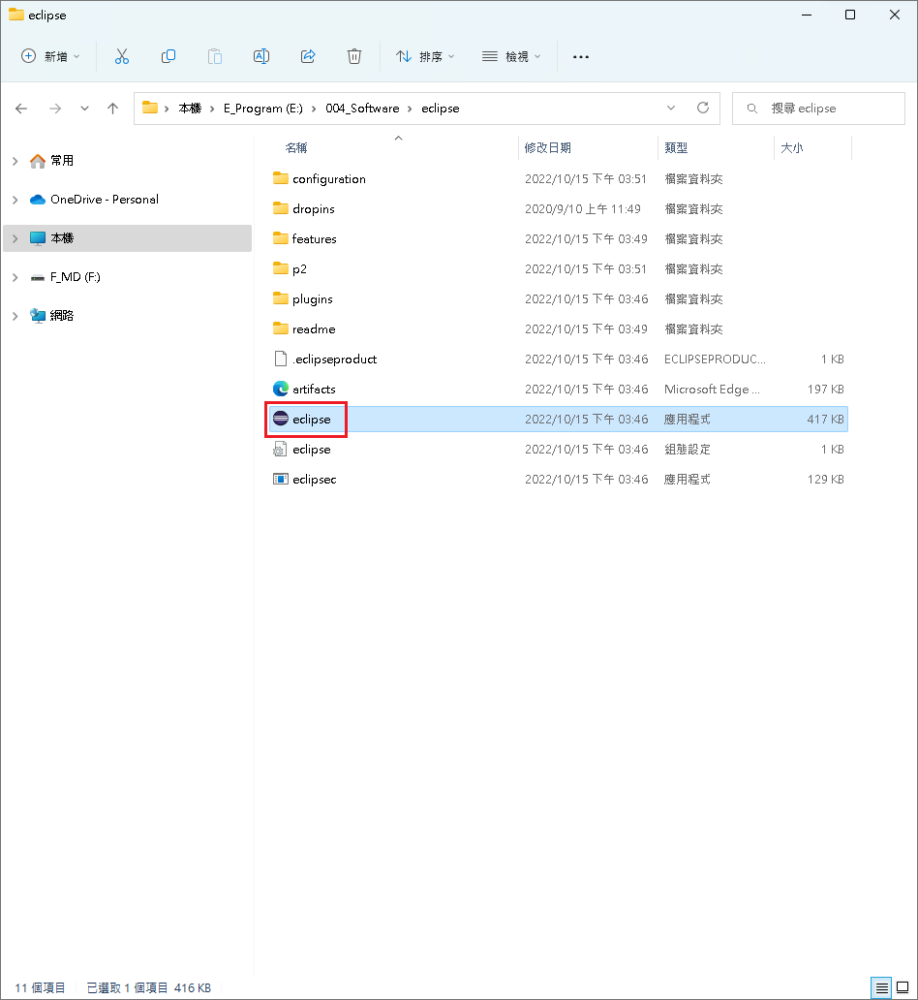
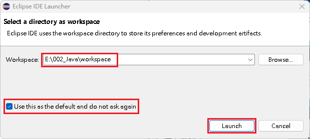

# 安裝 Eclipse IDE

## 安裝 Eclipse IDE

1. 至【 [Eclipse](https://www.eclipse.org/downloads/) 】下載相關程式。\
   <mark style="background-color:green;">本讀者使用舊版本 ( 2020-09 ) 的開發環境，來做後續 Java 程式使用。</mark>
2. 解壓縮在適當位置，無須安裝，即可直接執行。

<figure><figcaption>
下載網站
</figcaption></figure>

 

<figure><figcaption>
點選更多版本
</figcaption></figure>

 

<figure><figcaption>
點選所需的版本
</figcaption></figure>

 

<figure><figcaption>
下載所需的開發環境
</figcaption></figure>

## 執行 Eclipse IDE

1. 在工作區先建立一個工作目錄『workspace』。
2. 執行『eclipse.exe』。
3. 在第一次啟動 Eclipse 時，會需要先設定 workspace 的所在位置。\
   1\. 點選『 Browse... 』，選擇所建立的工作目錄。\
   2\. 將『 Use this as the default and do not ask again 』選項勾選。\
   3\. 點選『 Launch 』。

<figure><figcaption>
按下 eclipse.exe
</figcaption></figure>

 

<figure><figcaption>
第一次啟動 Eclipse 時，需要設定的相關資訊
</figcaption></figure>


【 M@nGo 留言區 】\
如有任何建議的地方，請前往芒果留言區留言。

