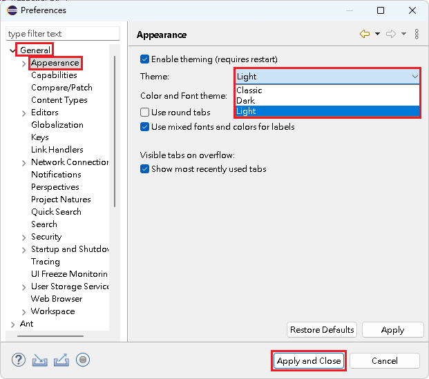

# 背景樣式

## 背景樣式

1\. 點選『 Window 』->『 General 』->『 Preferences 』。

<figure><figcaption></figcaption></figure>

2\. 點選『 General 』->『 Appearance』，編輯『 Theme 』內的背景樣式，\
&#x20;   編輯完資訊後，點選『 Apply and Close 』，關閉視窗。

<figure><figcaption></figcaption></figure>


【 M@nGo 留言區 】\
如有任何建議的地方，請前往芒果留言區留言。

