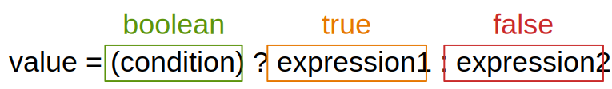

# Java 程式起點 main()




```java
public class SecondJava {

    public static void main(String[] argv) {

        System.out.println("自己編寫的第二支 Java 程式");
        System.out.println("大家好!!");

    }

}
```



```
自己編寫的第二支 Java 程式
大家好!!
```


* main() 為 Java 程式真正執行的起點。


【 M@nGo 留言區 】\
如有任何建議的地方，請前往芒果留言區留言。

