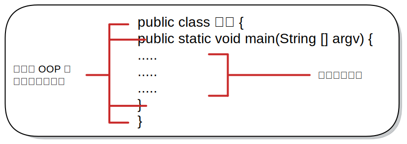

# 區塊 Block




```java
public class FirstJava {
    public static void main(String[] argv) {

        System.out.println("自己編寫的第一支 Java 程式");

    }
}
```



```
自己編寫的第一支 Java 程式
```


* 程式檔的名稱和 class 之後的區塊名稱完全一樣（包含大小寫）。
* 程式中以一對大括號 { 與 } 刮起來的部分，稱為區塊【 Block 】。
* 為了凸顯區塊，且方便識別區塊的包含關係，撰寫程式時，\
  會習慣將區塊包含的內容往右縮排（Indent）。\
  <mark style="color:blue;background-color:blue;">※ 讀者習慣右縮 4 個空格。</mark>


【 M@nGo 留言區 】\
如有任何建議的地方，請前往芒果留言區留言。

