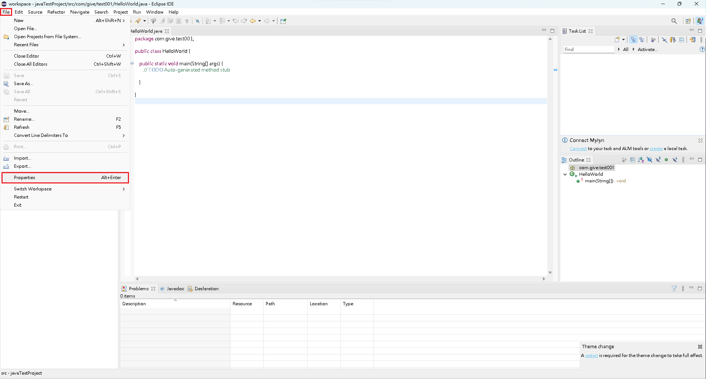
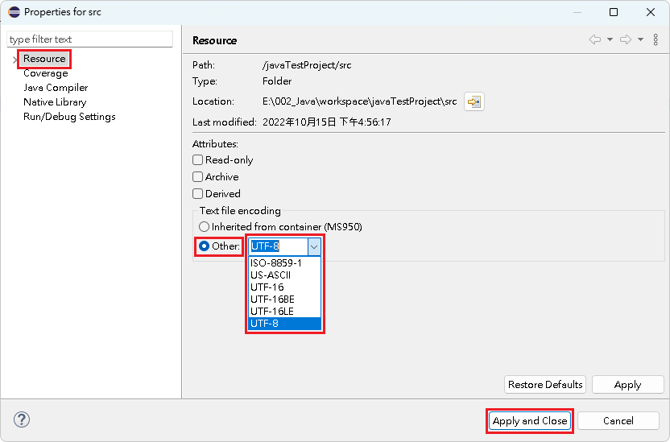

# 編碼方式

## 編碼方式

1\. 點選『 File 』->『 Properties 』。

<figure><figcaption></figcaption></figure>

2\. 點選『 Resource 』，在『 Text file encoding 』勾選『 Ohter 』，\
&#x20;   在下拉式選項內，選取所需的編碼方式。

<figure><figcaption></figcaption></figure>


【 M@nGo 留言區 】\
如有需修改的地方，請前往芒果留言區留言

