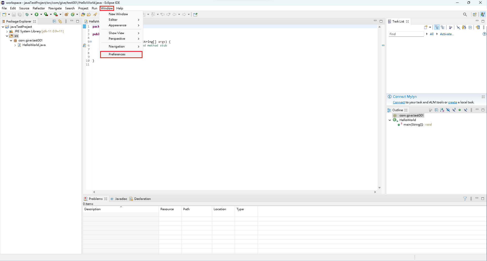
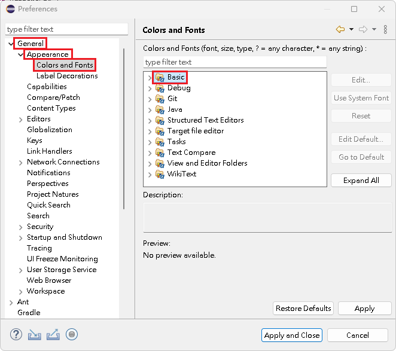
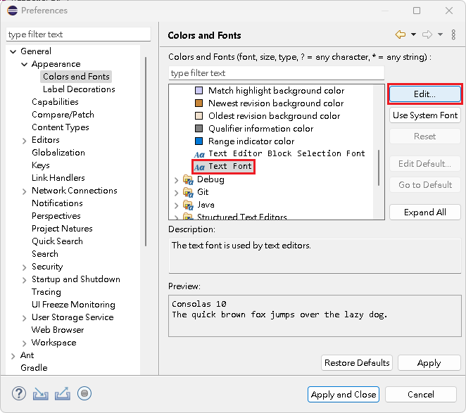
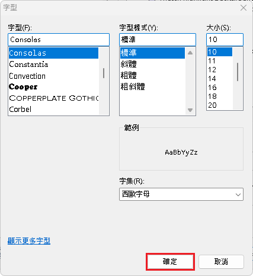
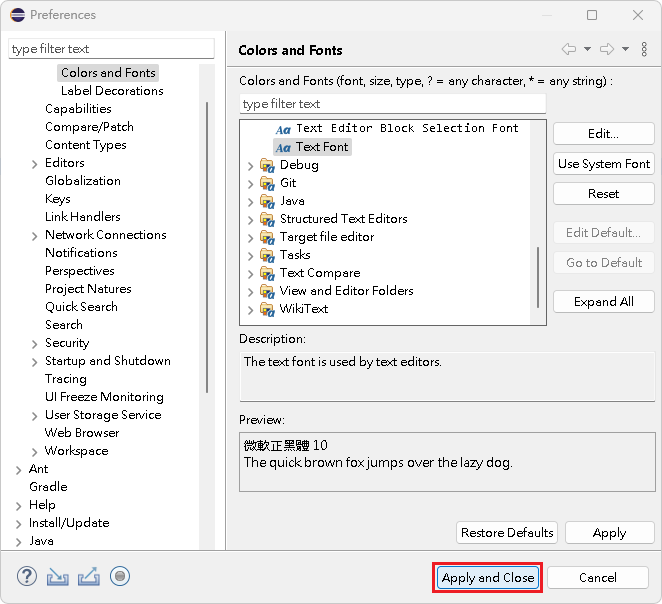

# 字體大小

## 字體大小

1\. 點選『 Window 』->『 General 』->『 Preferences 』。

<figure><figcaption></figcaption></figure>

2\. 點選『 General 』->『 Appearance』->『 Colors and Fonts 』。

<figure><figcaption></figcaption></figure>

3\. 在『 Colors and Fonts 』內，執行下述事項，就可在『字型』編輯相關資訊：\
&#x20;   1\. 點選『 Basic 』->『 Text Font 』。\
&#x20;   2\. 按下『 Edit... 』，開啟『字型』編輯視窗。\
&#x20;   3\. 編輯完資訊，點選『 確定 』，關閉視窗。

<figure><figcaption></figcaption></figure>

 

<figure><figcaption></figcaption></figure>

 

<figure><figcaption></figcaption></figure>

4\. 點選『 Apply and Close 』，關閉視窗。

<figure><figcaption></figcaption></figure>


【 M@nGo 留言區 】\
如有需修改的地方，請前往芒果留言區留言

