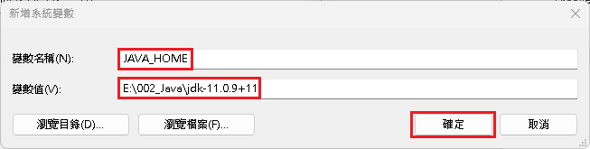

# 設置 Open JDK

## 步驟 1 \_下載 Open JDK

至網站下載 Open JDK，可至 [OpenJDK ](https://openjdk.org/)或 [openlogic](https://www.openlogic.com/openjdk-downloads)下載。\
<mark style="background-color:green;">推薦使用 JDK 11 來做後續 Java 程式使用。</mark>

## 步驟 2\_安裝 Open JDK

將 Open JDK 解壓縮在硬碟內。

## 步驟 3\_JAVA\_HOME 系統環境變數設定

1\. 至『控制台』->『系統及安全性』->『<mark style="background-color:yellow;">系統</mark>』。

<figure><figcaption>
點選控制台
</figcaption></figure>

 

<figure><figcaption>
點選系統及安全性
</figcaption></figure>

 

<figure><figcaption>
點選系統
</figcaption></figure>

2\. 至『系統資訊』->『裝置規格』->『相關連結』->『<mark style="background-color:yellow;">進階系統設定</mark>』。

<figure><figcaption>
點選進階系統設定
</figcaption></figure>

3\. 至『系統內容』->『進階』->『<mark style="background-color:yellow;">環境變數</mark>』。

<figure><figcaption>
點選環境變數
</figcaption></figure>

4\. 至『環境變數』->『系統變數』->『<mark style="background-color:yellow;">新增(W)...</mark>』。

<figure><figcaption>
點選系統變數的新增
</figcaption></figure>

5\. 在『新增系統變數』內新增下述資訊，在點選『<mark style="background-color:yellow;">確定</mark>』：\
&#x20;  1\. 變數名稱：<mark style="color:red;">JAVA\_HOME</mark>\
&#x20;  <mark style="color:red;"></mark>   <mark style="color:blue;">2.</mark> 變數值：<mark style="background-color:blue;">放置 OpenJDK 的目錄位置</mark>

<figure><figcaption>
輸入相關變數資訊，並點選確定
</figcaption></figure>

6\. 此時在系統變數內就會多一個名叫『<mark style="background-color:orange;">JAVA\_HOME</mark>』的系統變數。

<figure><figcaption>
新增名為 JAVA_HOME 的系統環境變數
</figcaption></figure>

## 步驟 4\_PATH 系統環境變數設定

1\. 在『環境變數』->『系統變數』，找尋『<mark style="background-color:orange;">Path</mark>』的系統變數，\
&#x20;  點選兩下或點選『<mark style="background-color:yellow;">編輯(I)...</mark>』，來開啟視窗。

<figure><figcaption>
編輯 Path 系統環境變數
</figcaption></figure>

2\. 在『編輯環境變數』，按下『<mark style="background-color:yellow;">新增(N)</mark>』，並新增下述資訊：\
&#x20;   <mark style="color:red;">%AVA\_HOME%\bin</mark>

<figure><figcaption>
新增 JAVA_HOME 的環境變數
</figcaption></figure>

3\. 點選新增的『<mark style="background-color:orange;">%JAVA\_HOME%\bin</mark>』欄位，並點選『<mark style="background-color:orange;">上移(U)</mark>』，\
&#x20;   將該欄位移至第一位後，點選『<mark style="background-color:yellow;">確認</mark>』並關閉視窗。

<figure><figcaption>
將新增的環境變數上移
</figcaption></figure>

 

<figure><figcaption>
將環境變數移至第一位
</figcaption></figure>


【 M@nGo 留言區 】\
如有需修改的地方，請前往芒果留言區留言

