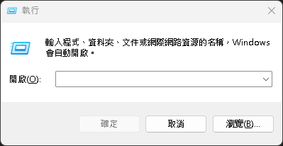
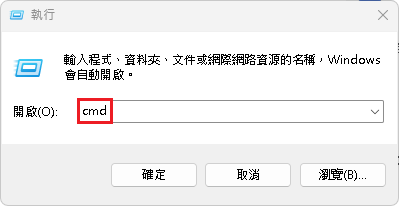
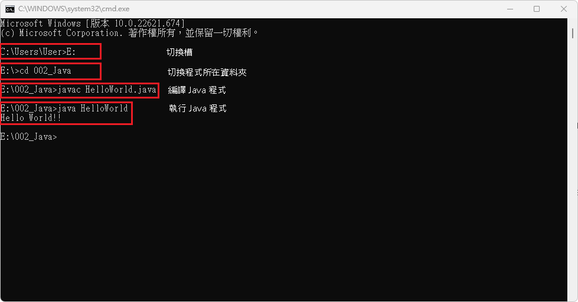

# Hello World!!

## 步驟 1\_撰寫 Java 程式

在記事本內，撰寫下述程式碼，並儲存副檔名為『HelloWorld.java』的檔案

```java
// 撰寫 Hello World 的 Java 程式
public class HelloWorld{

       public static void main(String[] args){

              System.out.println("Hello World!!");

       } // End of main()

} // End of class HelloWorld
```



## 步驟 2\_編譯 Java 程式

1\. 按『win』+『R』，開啟『執行』視窗。

<figure><figcaption><p>按下 WIN + R，開啟『執行』視窗</p></figcaption></figure>

2\. 在『開啟(O):』輸入開【cmd】指令，開啟『命令提示字元』。

<figure><figcaption><p>輸入 cmd 指令</p></figcaption></figure>

3\. 在『命令提示字元』執行下述步驟：\
&#x20;   1\. 輸入【D:】指令，切換到指定槽。\
&#x20;   2\. 輸入【cd （Java程式所放置的資料夾名稱）】指令，切換到指定槽。\
&#x20;       例：cd Java\_test\
&#x20;   3\. 輸入【javac HelloWorld.java】指令並執行，\
&#x20;       在編譯程式後會產生【HelloWorld.class】的檔案。\
&#x20;   4\. 輸入【java HelloWorld】指令，執行 Java 程式，就會顯示下述範例。

<figure><figcaption><p>執行相關指令</p></figcaption></figure>

```
// 命令提示字元執行狀況
Hello World!!
```



【 M@nGo 留言區 】\
如有需修改的地方，請前往芒果留言區留言

