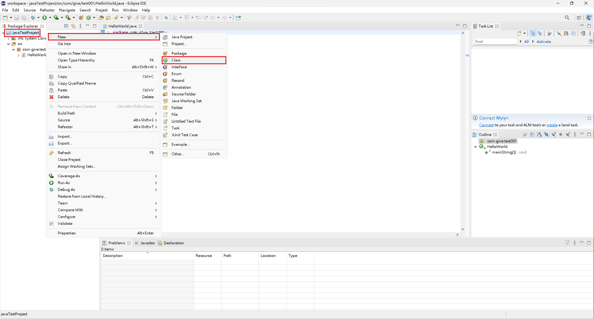
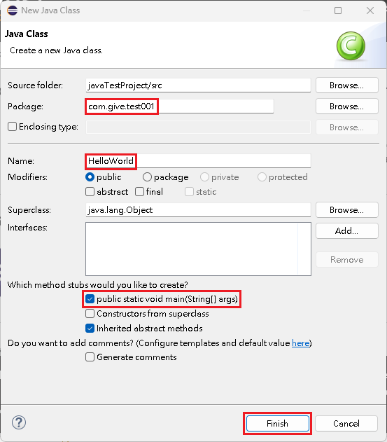
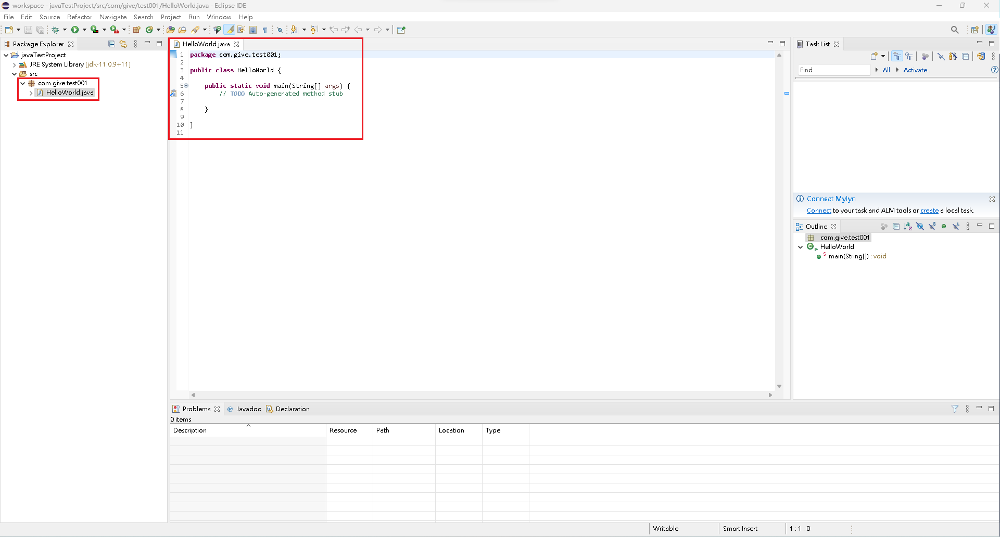

# 建立新類別

## 建立 Java 新類別 ( Class )

1\. 右鍵點選要建立類別的專案 ->『 New 』->『 Class 』。

<figure><figcaption></figcaption></figure>

2\. 在『 New Java Class 』內，編輯下述項目，就可在所屬的專案內看到新類別：\
&#x20;   1\. 在『 Package 』內，輸入類別所放置的套件位置。\
&#x20;   2\. 在『 Name 』內，輸入類別名稱。\
&#x20;   3\. 勾選『 public static void main(String\[] args) 』。\
&#x20;   4\. 點選『 Finish 』。

<figure><figcaption></figcaption></figure>

 

<figure><figcaption></figcaption></figure>


【 M@nGo 留言區 】\
如有需修改的地方，請前往芒果留言區留言

