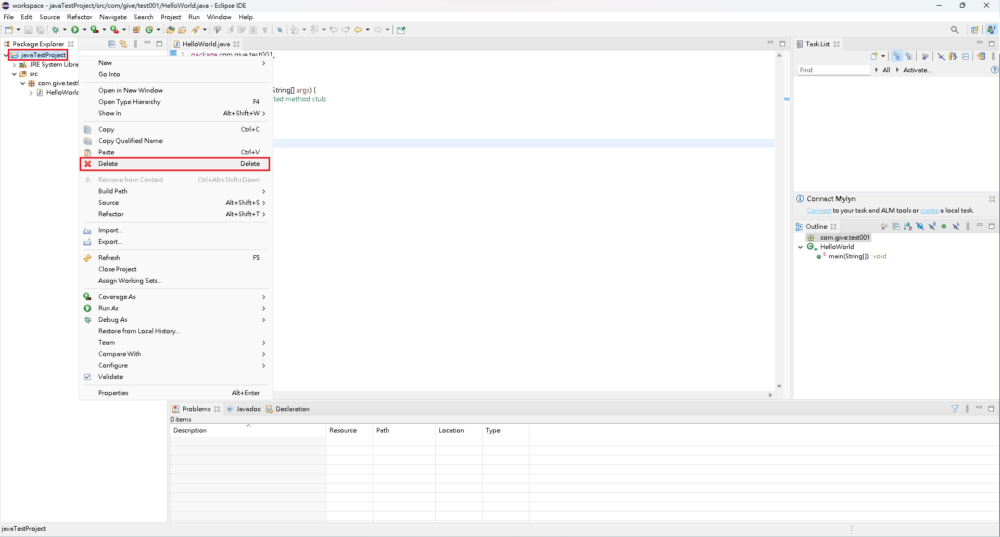
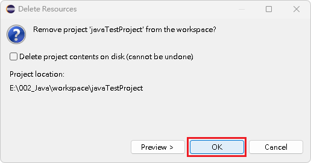
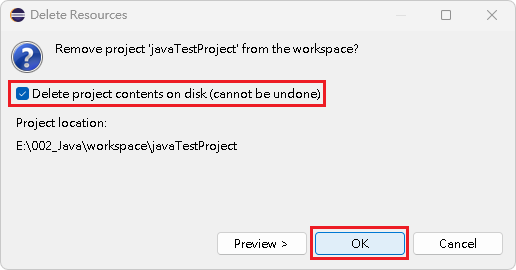

# 刪除專案

## 刪除專案

1\. 在欲刪除專案上，按下右鍵，點選『 Delete 』。

<figure><figcaption></figcaption></figure>

2\. 在『 Delete Resources 』內，執行下述項目：\
&#x20;   1\. 只是要將專案從 Eclipse IDE 中的 Package Explorer 移除，\
&#x20;      就直接點選『 OK 』。

<figure><figcaption></figcaption></figure>

&#x20;   2\. 如果要從檔案總管目錄中真正刪除，\
&#x20;       就要先勾選『 Delete Project contents on disk ( cannot be undone ) 』，\
&#x20;       再點選『 OK 』。

<figure><figcaption></figcaption></figure>


【 M@nGo 留言區 】\
如有需修改的地方，請前往芒果留言區留言

