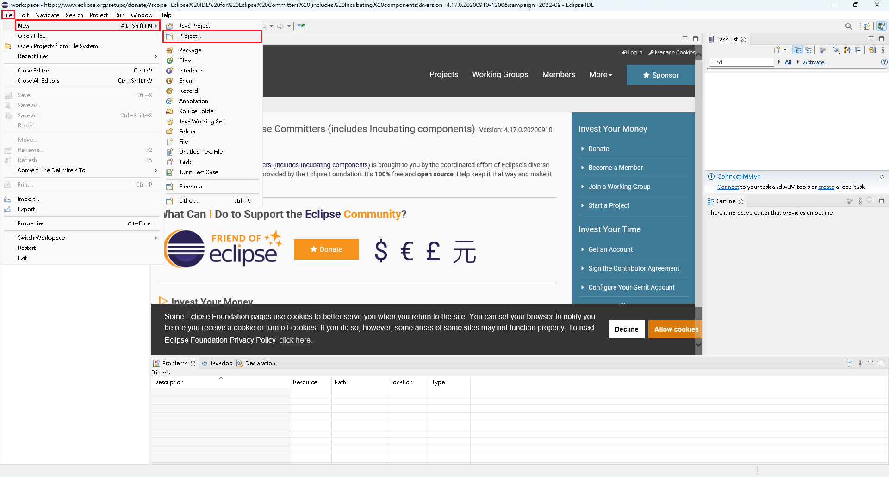
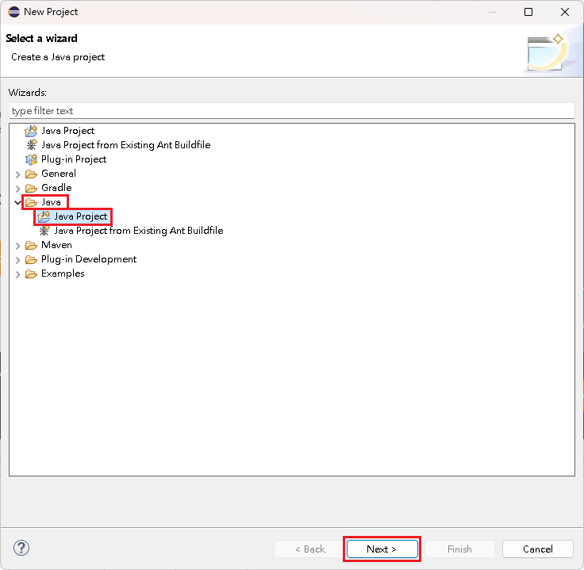
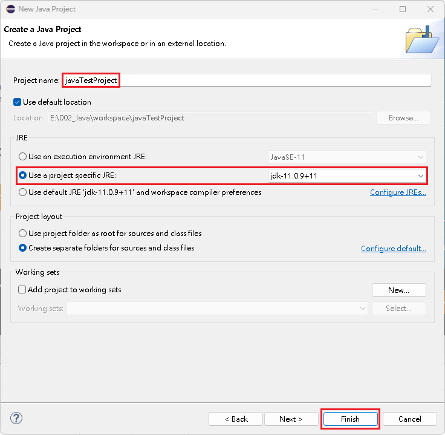
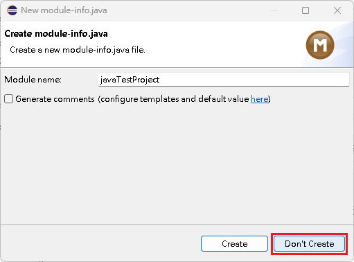

# 建立新專案和類別

## 建立 Java 新專案

1\. 點選『File』->『New』->『Project...』。

<figure><figcaption></figcaption></figure>

2\. 在『New Project』內，選取『Java』->『Java Project』，再點選『Next >』。

<figure><figcaption></figcaption></figure>

3\. 在『New Java Project』內，編輯下述項目：\
&#x20;   1\. 在『Project name』內，編輯 Java 專案名稱。\
&#x20;   2\. 在『JRE』內，選取『Use a project specific JRE』，\
&#x20;       確認後面的 Open JDK 資訊與設置在電腦內的相同。\
&#x20;   3\. 點選『Finish』。『』

<figure><figcaption></figcaption></figure>

4\. 在『New module-info.java』，編輯下述項目，就可在頁面內看到所建立的專案：\
&#x20;   1\. 點選『Don't Create』。

<figure><figcaption></figcaption></figure>


【 M@nGo 留言區 】\
如有需修改的地方，請前往芒果留言區留言

