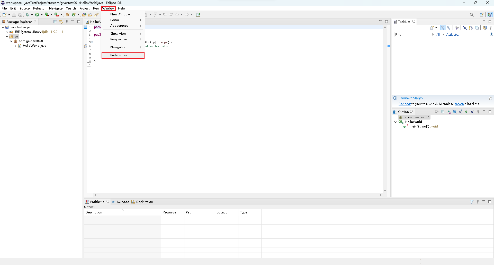
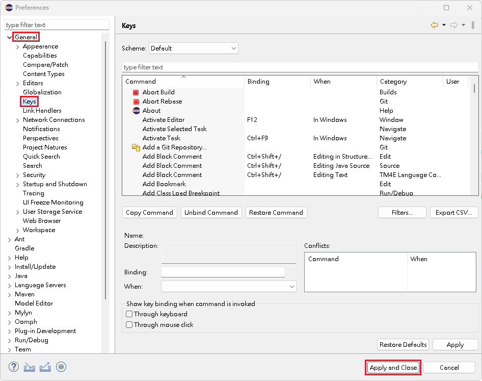

# 快捷鍵

## 常用快捷鍵

* Ctrl + Shift + O => 自動匯入所需要的類別。
* Alt + /               => 程式碼提醒，自動補齊 Template。
* Ctrl + Shift + F  => 程式碼自動排版。
* Ctrl + F11          => 快速執行程式。
* Ctrl + /              => 將選取的文字，以多行註解的方式，註解起來。
* Ctrl + D             => 刪除當前這一行。
* Ctrl + Shift + L   => 查看快捷鍵組合。

## 設置快捷鍵

1\. 點選『  Window 』->『 Preferences 』。

<figure><figcaption></figcaption></figure>

2\. 點選『 General 』->『  Key 』， 編輯完相關資訊，點選『  Apply and Close 』。

<figure><figcaption></figcaption></figure>


【 M@nGo 留言區 】\
如有需修改的地方，請前往芒果留言區留言

