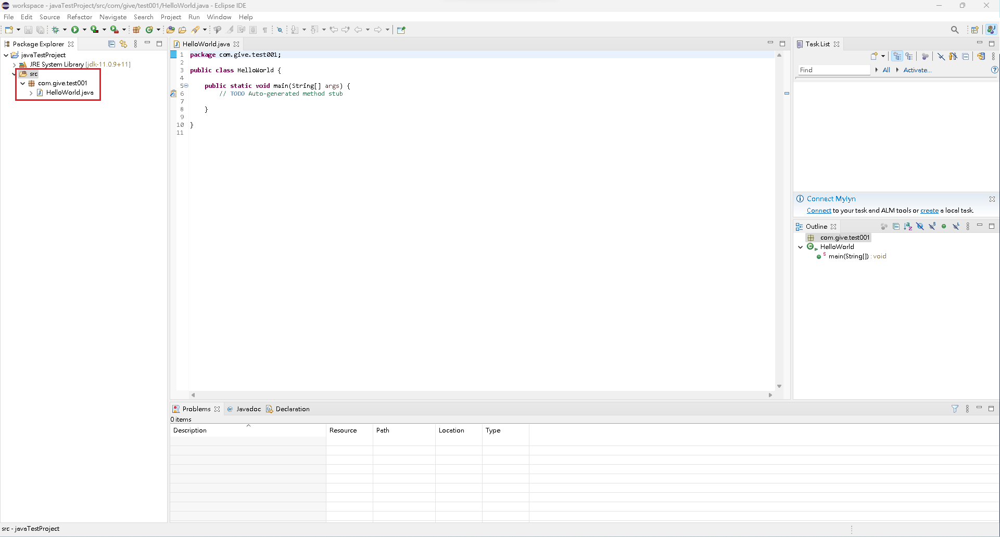
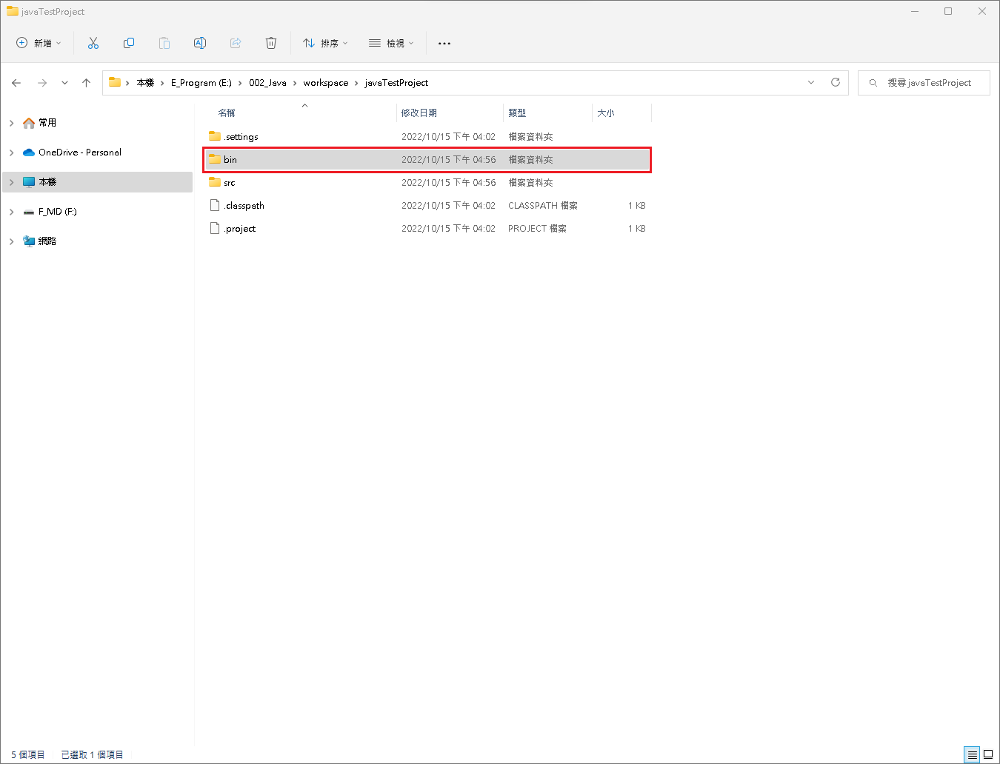

# 專案目錄

## src 資料夾

1. 放置原始碼的 .java 檔案。

<figure><figcaption></figcaption></figure>

## bin 資料夾

1. 放置編譯生成的 .class 檔案。
2. 在 Eclipse 內無法看到該資料夾，須至檔案總管，才能看到相關資訊。

<figure><figcaption></figcaption></figure>


【 M@nGo 留言區 】\
如有需修改的地方，請前往芒果留言區留言

